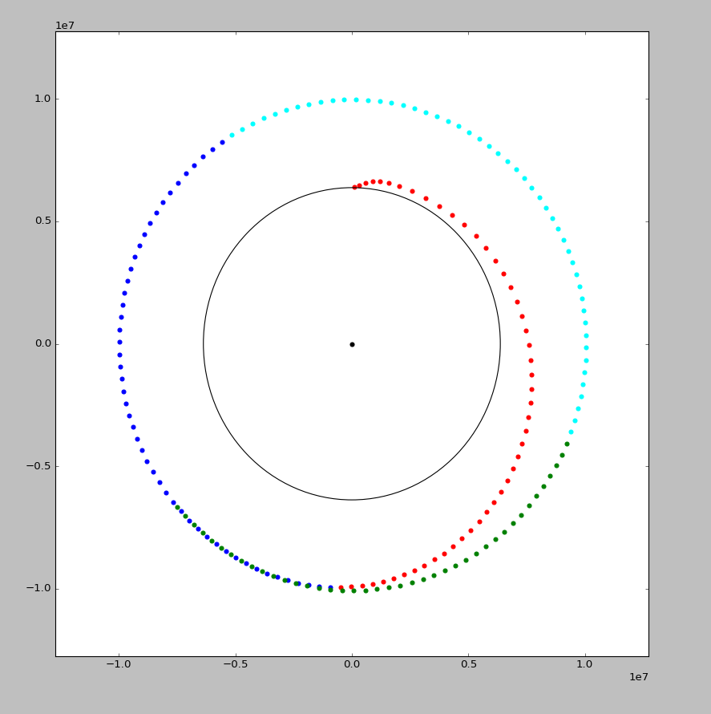
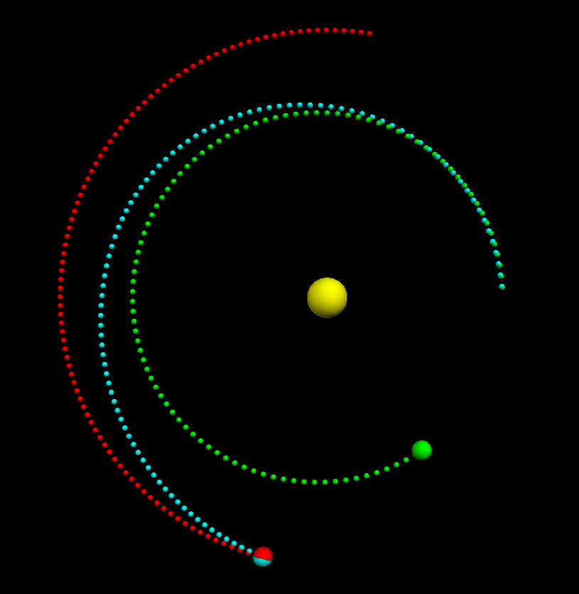
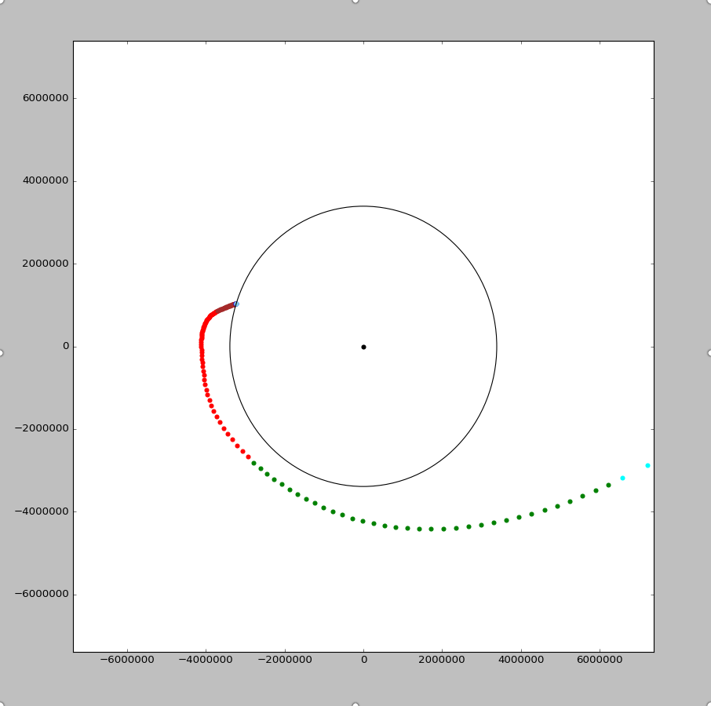
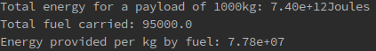

# Simulation of Rocket Flight

This is a simple simulation of rocket flight from earth's surface to Mars. 

## Dependencies:
1. Python2
2. VPython
3. `matplotlib` 

## Problem
This project aims to simulate a rocket flight from Earth's surface to Mars.

## Solution
The solution has been divided into three parts: the flight to earth's lower orbit, inter-planetary flight and the landing.  
It takes into account the following things:

1. Gravity from sun, earth and mars
2. Rocket's thrust in 2 

However, to keep the project simple and limited to basic physics knowledge, a lot of assumptions have been made, notably the following:

### * Everything in the universe is 2-dimensional.
To a certain degree, [this is a truth](https://www.youtube.com/watch?v=MTUsOWtxKKA). This assumption makes things so much simpler. The assumption that the Earth is a circle is made to reduce all sorts of compications including axial rotations, rotational speed variation at different latitudes, etc.

### * No atmosphere in Earth or Mars
When there is atmosphere, there is drag. When drag is incorporated, there is a need of differential equations to be solved. So, to avoid all sorts of complications and also to keep the project simple for a basic physics class, the idea of atmosphere has been completely removed.

### * Rocket's mass loss is concentrated at two fixed points.
Real rockets have various stages of flight when they drop off fuel containers when emptied. In ths project, the first "dropping" is done when escaping earth's lower orbit and after reaching Mars's orbit.

## Procedure
### Flight to Earth's Lower Orbit

> This part is handled by the script `to_lower_orbit.py`. After installing the dependencies, run this script using `python to_lower_orbit.py`.

The earth is assumed to be a two-dimensional circle. Here's the procedure
1. The ground speed of Earth is calculated using the following formula:

```
speed = distance / time
speed of rotation of earth= 2 * π * radius of earth / 24 hours
                          ~ 460 m/s 
```
2. The rocket is assumed to have an initial speed of `(0, speed_of_rotation_of_eath)`.
3. The rocket is propelled by an initial 2-dimensional force(`a`) and continuded to do so until it reach
es a certain time. Then, the force of perigee is acted on the rocket. After it tends to reach apogee, a
new force is applied on the rocket. After applying this force, the rocket seemingly looks to be in a sta
ble, circular orbit.

> Note: When a body is in orbit, the highest point it reaches is called the apogee, and the lowest point is called the perigee. More on apogee and perigee [here](https://en.wikipedia.org/wiki/Apsis).

### Interplanetary Flight

The Sun is the yellow sphere in the center. The Earth is the green one, the Mars the red one and the cyan sphere is the rocket.

> This part is handled by the script `physical_object_simulator.py`. After installing the dependencies, run this script using `python physical_object_simulator.py`.

> The presence of sun is considered in this part.

#### Setup
* The Earth, Sun and Mars are all aligned on a straight line. This is to reduce all sorts of complications. However, this is not the best configuration there can be. 
* Earth and the Mars are given an initial speed using [fact sheets](http://nssdc.gsfc.nasa.gov/planetary/factsheet/earthfact.html). 

#### Theory
It is assumed that the sun's effect is negligible until Earth's lower orbit. After leaving the Earth's orbit, this assumption is no longer considererd and all the gravitational pull are considered. For all of the objects(Earth, Mars, the Sun and the rocket), gravitational pull from all bodies are considered and applied simultaneously. As an example, the rocket is pulled by the sun but the same pull is applicable to the sun by the rocket. 

> If just Earth and Sun are placed, the Earth forms a nearly-circualar orbit.
  
> Since an n-body gravitational pull algorithm is used, extra bodies can be added. For example, to add Earth's moon, import `moon` from `physical_object.py` and register it on the "world" using `moon.register`. See `physical_object.py` for more details.

#### Flight
The rocket is headed on a certain direction chosen by hit-and-trial. As [defined in the file](physical_object.py#L186), it accepts two propulsions:

```
rocket.propulsions = [
    {"force": vector(5, 1), "from":10, "duration": 2500},
    {"force": vector(-1.6, -2), "from":2776900, "duration":5000},
]
```
The `from` and `duration` values are in seconds, whereas the `force` is in Newtons.

> Standard SI units are used in used in the entire project.


### Flight to Mars's surface


### Calculation of total energy and energy cost

